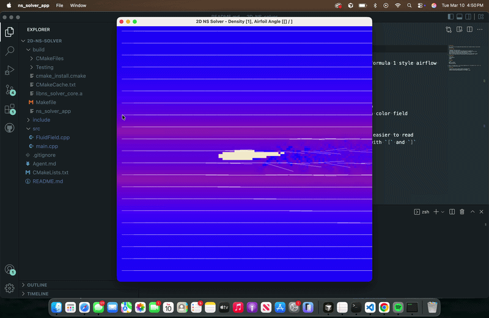

## Disclaimer: Vibe Coded Project Shoutout Codex/Claude Code
# 2D NS Solver

Early scaffold for a 2D incompressible Navier-Stokes solver focused on Formula 1 style airflow visualization.

## Demo



## Current scope

- CMake-based C++20 project layout
- `FluidField` core type with an initial Stable Fluids style update loop
- SFML window that renders density, velocity magnitude, or pressure as a color field
- Mouse injection to seed density and upward velocity into the domain
- Basic left-boundary inflow to mimic a wind tunnel feed
- Built-in airfoil-like obstacle mask and tracer bands to make the wake easier to read
- Sparse velocity glyph overlay and runtime angle-of-attack adjustment with `[` and `]`

## Dependencies

- CMake 3.20+
- A C++20 compiler
- Eigen 3+
- SFML 3+

## Configure

```bash
cmake -S . -B build
cmake --build build
ctest --test-dir build --output-on-failure
./build/ns_solver_app
```

Press `1` for density view, `2` for velocity magnitude, and `3` for pressure. Use `[` and `]` to decrease or increase airfoil angle.

## Next steps

- Introduce more realistic obstacle geometry and editable masks
- Tighten inflow/outflow handling around solid boundaries
- Add tests and performance measurements for the `128x128` target
